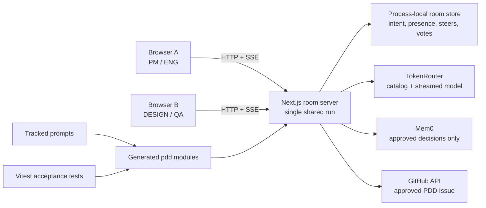

# CoPrompt

<p align="center">
  
</p>

**Multiplayer prompt-driven development: a team steers one shared AI run and
ships only what the room approves.**

[Live demo](https://coprompt-ai.onrender.com) ·
[Submission package](SUBMISSION.md) ·
[PDD evidence](PDD_EVIDENCE.md) ·
[Demo script](docs/DEMO.md)

## Judge it in 60 seconds

1. Open the [live demo](https://coprompt-ai.onrender.com) in two browser windows.
2. Join the public **Demo** room with two different names and roles.
3. Edit the shared intent, start one run, then send a **NUDGE** from the other
   window while the run is active. Every prompt and action appears in room
   activity.
4. Review the same conversation-style agent response, streamed progress, and
   generated artifact in both windows.
5. Open the approval panel to inspect every eligible member's vote. Submit one
   change request and confirm its feedback appears in room activity.
6. Open [PDD_EVIDENCE.md](PDD_EVIDENCE.md) to see the prompt → artifact →
   production call site → acceptance test chain and the evidence-led iteration.

The deployed health endpoint is
[`/api/health`](https://coprompt-ai.onrender.com/api/health).

## The problem

AI coding tools are designed around one operator, but product decisions belong
to a team. Intent gets fragmented across chat, the loudest person controls the
agent, teammates cannot tell whether their feedback was consumed, and generated
work can ship without shared approval.

**Target user:** small product and engineering teams using AI agents to turn a
shared product decision into a reviewable implementation.

## The solution

CoPrompt adds the missing collaboration and governance layer around an AI run:

- one shared intent and one server-side agent run;
- visible participant roles, presence, decision priority, and per-person
  contribution state;
- mid-run NUDGE/HALT steering consumed at explicit checkpoints;
- Member Chat that is never sent to the model and uses zero AI tokens;
- conversation-first shared run with code kept in a dedicated technical tab;
- browser-ready artifact preview, generated code, criteria, and tests;
- creator-configurable, server-enforced role powers and unanimous room approval;
- approved PDD Issue export to GitHub;
- optional Mem0 recall of approved room decisions only.

The core innovation is not another chat interface. It makes prompt intent a
team-owned, inspectable asset and makes agreement an executable shipping gate.

## What we built today

- English-first interface with Traditional Chinese switch and light/dark mode.
- Public and private rooms, invite links, creator settings, configurable role
  powers, and decision priorities.
- Optional project ZIP context, bounded and read server-side only.
- TokenRouter live-catalog model selection with deterministic non-Opus routing.
- One SSE room stream for presence, progress, steering, artifacts, and votes.
- Three-phase AI execution with visible “picked up” versus “waiting” feedback.
- HTML preview/code, generated JavaScript download, acceptance criteria, tests,
  versioned artifacts, and a per-member approval status panel.
- Server-side quorum and role checks before GitHub PDD Issue export.
- Opt-in Mem0 room memory written only after approval.
- Six prompt-owned decision artifacts with acceptance tests.

## PDD method and traceability

Prompts, acceptance criteria, and tests are the durable source. Files under
`pdd/` are generated artifacts. Behavioral changes belong in the prompt,
followed by regeneration and tests—not in an untracked artifact patch.

| Decision | Prompt | Generated artifact | Production use | Test |
|---|---|---|---|---|
| Token allocation | [`prompts/token_split_typescript.prompt`](prompts/token_split_typescript.prompt) | [`pdd/token-split.ts`](pdd/token-split.ts) | [`lib/server/run-agent.ts`](lib/server/run-agent.ts) | [`tests/token-split.test.ts`](tests/token-split.test.ts) |
| Approval quorum | [`prompts/approval_quorum_typescript.prompt`](prompts/approval_quorum_typescript.prompt) | [`pdd/approval-quorum.ts`](pdd/approval-quorum.ts) | vote and export API routes | [`tests/approval-quorum.test.ts`](tests/approval-quorum.test.ts) |
| Role powers | [`prompts/role_policy_typescript.prompt`](prompts/role_policy_typescript.prompt) | [`pdd/role-policy.ts`](pdd/role-policy.ts) | agent, vote, and export gates | [`tests/role-policy.test.ts`](tests/role-policy.test.ts) |
| Model choice | [`prompts/model_router_typescript.prompt`](prompts/model_router_typescript.prompt) | [`pdd/model-router.ts`](pdd/model-router.ts) | [`lib/server/tokenrouter.ts`](lib/server/tokenrouter.ts) | [`tests/model-router.test.ts`](tests/model-router.test.ts) |
| Code download | [`prompts/generated_code_download_javascript.prompt`](prompts/generated_code_download_javascript.prompt) | [`pdd/generated-code-download.ts`](pdd/generated-code-download.ts) | [`app/page.tsx`](app/page.tsx) | [`tests/generated-code-download.test.ts`](tests/generated-code-download.test.ts) |

The strongest documented iteration is preserved in Git history:

```text
1d368dc  token_split prompt v1
04b4544  conservation and determinism acceptance tests
3debc17  prompt v2 adds exact conservation and largest-remainder rules
ec4da49  the proven contract is ported to the current TypeScript artifact
```

The acceptance evidence found that `100` tokens split three ways became
`33 + 33 + 33 = 99`. The team changed the **prompt**, regenerated, and pinned
`34 + 33 + 33 = 100`; it did not patch the artifact. Full evidence and
reproduction commands are in [PDD_EVIDENCE.md](PDD_EVIDENCE.md).

## Architecture



The agent context is assembled on the server in this order:

1. shared system prompt and role ownership;
2. shared intent;
3. optional bounded ZIP project context;
4. relevant approved Mem0 room decisions;
5. recent AI-visible conversation, excluding Member Chat.

## Technical safeguards

- Integration keys are server-only and never use a `NEXT_PUBLIC_` prefix.
- Room-specific provider keys remain in server memory and are omitted from
  snapshots and health responses.
- Project ZIPs are limited by size, entry count, file count, and total extracted
  text; secrets and non-text/binary files are excluded.
- Member Chat, credentials, uploaded source, and generated code are excluded
  from Mem0 writes.
- Unknown roles fail closed to observer permissions.
- Quorum and role powers are enforced in API routes, not only by disabled UI.
- Mem0 fails open so a memory outage does not block the core run.

## Run locally

Requires Node.js 22 or newer.

```bash
cp .env.example .env.local
npm ci
npm run dev
```

Required for live AI runs:

```dotenv
TOKENROUTER_API_KEY=
```

Optional integrations:

```dotenv
MEM0_API_KEY=
GITHUB_TOKEN=
GITHUB_OWNER=
GITHUB_REPO=
```

`TOKENROUTER_API_KEY` is preferred. The server also supports the compatibility
aliases documented in [`.env.example`](.env.example). Never commit real keys.

## Validate

```bash
npm run check
```

The gate runs TypeScript checking, all Vitest acceptance and boundary tests, and
a production Next.js build.

## PDD artifact chain: generated-code download

This commit includes a complete PDD artifact chain for the **Download generated
code** action in the room artifact panel. It is deliberately kept as a small,
reviewable library rather than embedding browser-download details in the React
screen.

| Chain stage | File | What it proves |
|---|---|---|
| Prompt source of truth | [`prompts/generated_code_download_javascript.prompt`](prompts/generated_code_download_javascript.prompt) | Defines the public API, lossless escaping requirements, browser-only download contract, validation rules, and forbidden behavior. |
| Generated artifact | [`pdd/generated-code-download.ts`](pdd/generated-code-download.ts) | Implements the prompt contract: arbitrary generated code becomes a self-contained ES-module `.js` download with a named and default export, then downloads through a UTF-8 Blob and browser anchor. The file header identifies the prompt it was generated from. |
| Product integration | [`app/page.tsx`](app/page.tsx) | Imports `downloadGeneratedJavaScript`, finds the latest generated HTML artifact, and invokes the PDD module when the user presses **Download generated code**. The UI never implements its own Blob or anchor-download logic. |
| Behavioral test | [`tests/generated-code-download.test.ts`](tests/generated-code-download.test.ts) | Verifies lossless embedding of code containing backticks and Unicode, and verifies rejection of blank source and invalid JavaScript export names. |

The generated download is intentionally a JavaScript ES module, not a raw HTML
file: it exports the generated browser artifact as a string, so judges or other
developers can import it, inspect it, or use it in another application without
depending on CoPrompt at runtime.

### Documented PDD iteration

The first version of this chain produced a `.ts` download. Hackathon evidence
review identified that the user-facing generated artifact should be directly
executable JavaScript instead. The prompt was changed from
`generated_code_download_typescript.prompt` to the JavaScript-specific prompt
above; the generated module was rerun with renamed JavaScript APIs, a `.js`
filename rule, and `text/javascript` Blob type; the page import/call site was
updated; and the acceptance test was updated to assert the JavaScript contract.
This is the documented evidence-driven prompt → artifact → integration → test
iteration required for the PDD submission.

To regenerate or review the artifact, start with the prompt above and compare
the resulting implementation against the tests. To run the same repository gate
used by this commit:

```bash
./scripts/pdd-sync.sh
```

## Deployment

Production is configured by [`render.yaml`](render.yaml):

- branch: `new`;
- Node.js 22;
- build: `npm ci && npm run build`;
- start: `npm start`;
- health check: `/api/health`;
- exactly one instance.

One instance is intentional because the current room store is process-local.

## Known limitations

- A restart clears non-Demo rooms and room-specific keys.
- Durable rooms, cross-instance presence, and stable identity require the
  prepared Supabase phase-two migration.
- Mem0 memory is room-scoped; there is no per-user memory management UI yet.
- GitHub export creates a PDD Issue, not a branch or pull request.
- Generated acceptance criteria and tests are review artifacts, not executed in
  an isolated sandbox.
- The prepared path-sandbox artifact is tested but is not currently wired to a
  repository-reading agent tool.

These boundaries are deliberate hackathon scope choices, not hidden claims.
See [`docs/IMPLEMENTATION_GAP_AUDIT.md`](docs/IMPLEMENTATION_GAP_AUDIT.md).

## Judging map

| Criterion | Evidence |
|---|---|
| PDD Method & Traceability — 25 | Five complete current chains plus the test-led prompt v1 → v2 iteration in [`PDD_EVIDENCE.md`](PDD_EVIDENCE.md) |
| Technical Execution — 25 | Server-enforced policy/quorum, key isolation, bounded ZIP ingestion, boundary tests, production build, and live health endpoint |
| Problem Fit & User Value — 20 | A specific collaboration and governance gap for teams directing AI coding agents |
| Innovation & Learning — 15 | Multi-human steering, visible input consumption, approval-gated export, and documented learning from failed conservation tests |
| Demo & Communication — 15 | Public live app, seeded Demo room, 60-second judge path, and timed [`docs/DEMO.md`](docs/DEMO.md) |

## Disclosure and license

Codex and Claude Code assisted implementation, migration, PDD prompt
translation, tests, and documentation. The PDD CLI generated decision modules
from tracked prompts. Humans controlled product direction, naming, scope,
acceptance decisions, and final submission copy. Runtime artifact generation is
clearly presented as AI output.

Third-party packages are declared in [`package.json`](package.json). The project
is released under the [MIT License](LICENSE).
