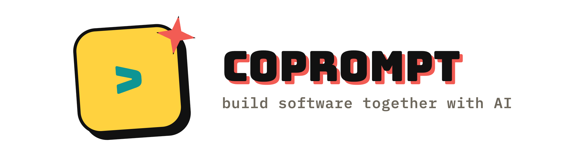

# CoPrompt

<p align="center">
  
</p>

<p align="center">
  <strong>A multiplayer workspace where product teams build and approve software with one shared AI agent.</strong>
</p>

<p align="center">
  <a href="https://coprompt-ai.onrender.com">Try the live product</a>
  ·
  <a href="https://coprompt-ai.onrender.com/api/health">Service health</a>
  ·
  <a href="#run-locally">Run locally</a>
</p>

## The problem

AI coding tools are built for one person at a time. Real product decisions are
not.

When a PM, engineer, designer, and QA lead work with AI, they usually split the
context across chat threads, documents, and separate prompts. The team then has
to reconcile conflicting instructions, determine which output is current, and
decide whether the result is ready to ship.

## The product

CoPrompt gives the team one room, one shared intent, and one AI run.

Everyone can contribute from their own role while the room keeps the scope,
conversation, generated artifact, and approval decision together. The result is
a visible path from “what should we build?” to “the team approved this version.”

### How it works

1. **Create a room** — start a public or private co-working session and invite
   the team.
2. **Align on intent** — define the goal and constraints in one shared document.
3. **Run one agent** — CoPrompt routes the task to an eligible model and shows
   which team inputs the agent has picked up.
4. **Steer together** — authorized members can nudge or halt the run without
   starting competing AI sessions.
5. **Review the result** — inspect the browser preview, generated code, review
   criteria, and tests in the same room.
6. **Approve as a team** — eligible members approve the proposal or request
   changes before downloading the result.

## What works today

- Public and private rooms with shareable invite links.
- Live presence, room activity, and synchronized member chat.
- A shared intent document with role-based editing permissions.
- One server-side AI run with progress, nudge, and halt controls.
- Automatic model selection through TokenRouter, with an optional room
  preference.
- Sandboxed preview for self-contained generated web artifacts.
- Generated code, review criteria, tests, and versioned artifacts.
- Unanimous approval tracking across eligible room members.
- ZIP project upload as read-only context for the shared agent.
- Optional Mem0 recall for approved room decisions only.
- English and Traditional Chinese interfaces, plus light and dark themes.

## Why this can matter

The quality of generated code is improving quickly, but team coordination is
still manual. CoPrompt is building the collaboration and decision layer around
AI software creation: who can change the scope, whose feedback has priority,
what the agent has seen, and whether the team accepted the result.

The initial wedge is small product teams that already use AI to prototype and
ship software but still coordinate the work across meetings, chat, documents,
and code review.

## Current stage

CoPrompt is a working MVP with a public demo. The core multi-person workflow is
implemented end to end: create a room, invite collaborators, write a shared
intent, run and steer the agent, review the artifact, and vote on approval.

The current deployment intentionally runs as one application instance because
live room state is still process-local. A Supabase schema is prepared for the
next persistence step.

## Product principles

- **One shared source of truth:** the room intent defines the work.
- **Visible decision ownership:** product, engineering, design, and QA roles
  have explicit permissions.
- **Private team coordination:** Member Chat is synchronized between members
  but is never sent to the AI.
- **Human approval before handoff:** generated output remains a proposal until
  the room accepts it.
- **No secret persistence:** room API keys stay in server memory and are never
  returned to the browser.

## Architecture

```text
Browser
  ├─ Next.js room interface
  ├─ Server-sent room events
  └─ Sandboxed artifact preview
          │
Next.js server
  ├─ Room state and role policy
  ├─ Shared-agent orchestration
  ├─ TokenRouter model selection
  ├─ Artifact and approval pipeline
  └─ Optional Mem0 decision memory
```

```text
app/                  Next.js interface and API routes
lib/                  Domain rules and shared utilities
lib/server/           Server-only room and AI integrations
public/               Product brand assets
supabase/migrations/  Prepared persistent room schema
tests/                Unit and boundary tests
render.yaml           Render service configuration
```

The core product rules remain separate from the interface:

- `lib/approval.ts` — calculates room approval status.
- `lib/code-download.ts` — packages the generated JavaScript handoff.
- `lib/model-router.ts` — selects an eligible model for the requested
  difficulty.
- `lib/roles.ts` — controls role permissions and voting eligibility.
- `lib/token-allocation.ts` — attributes model input across contributors.

## Run locally

Requires Node.js 22 or newer.

```bash
cp .env.example .env.local
npm ci
npm run dev
```

To enable live AI runs, add a TokenRouter key:

```dotenv
TOKENROUTER_API_KEY=
```

Optional services:

```dotenv
MEM0_API_KEY=
ROOM_SIGNING_SECRET=
```

Never commit real credentials.

## Validate

```bash
npm run check
```

This command runs TypeScript validation, the complete Vitest suite, and a
production Next.js build.

## Deployment

The repository includes a Render Blueprint:

- Node.js 22
- `npm ci && npm run build`
- `npm start`
- `/api/health` health check
- one application instance

The production service must be connected to this repository and the `new`
branch before changes can deploy automatically.

## Known limitations

- Restarting the server clears non-demo rooms and room-specific keys.
- Multiple instances do not yet share presence or room state.
- Generated tests are review artifacts; they are not executed in an isolated
  code sandbox.
- Authentication, durable room history, and production-grade organization
  controls are not implemented yet.

These are the next infrastructure milestones, not hidden production claims.

## YC application material

The product summary, draft application answers, founder-video outline, and demo
flow live in [`docs/YC_APPLICATION.md`](docs/YC_APPLICATION.md).

## License

[MIT](LICENSE)
